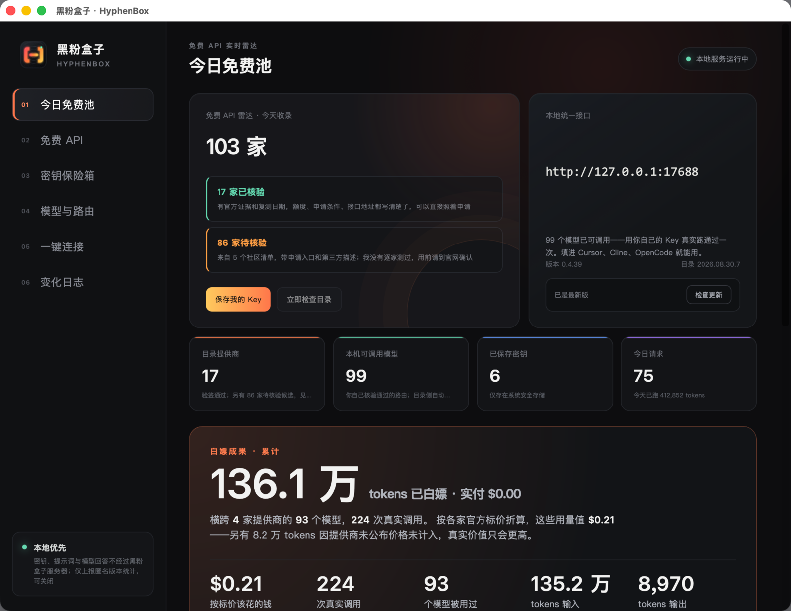
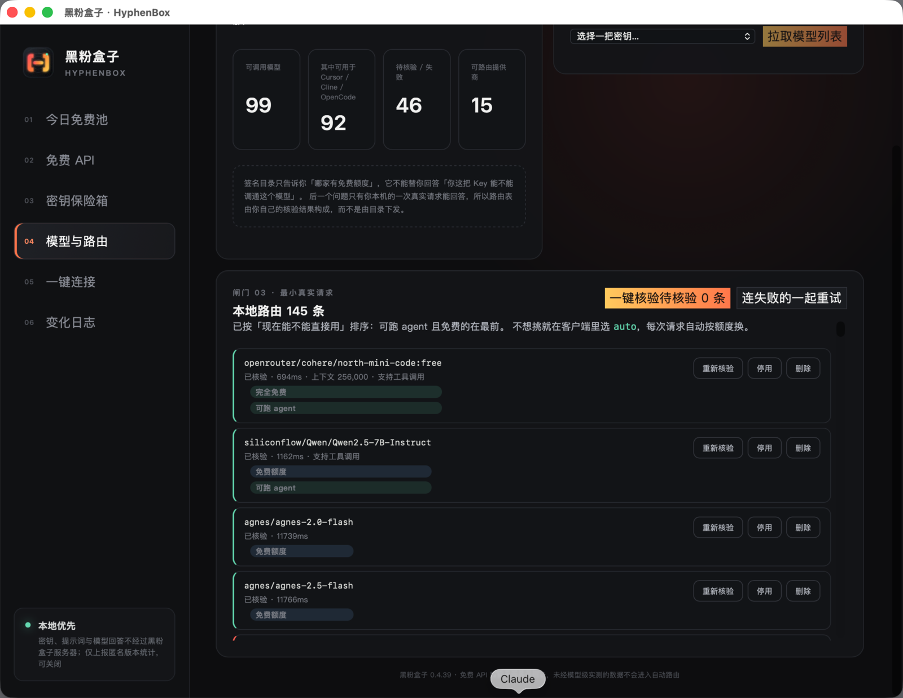
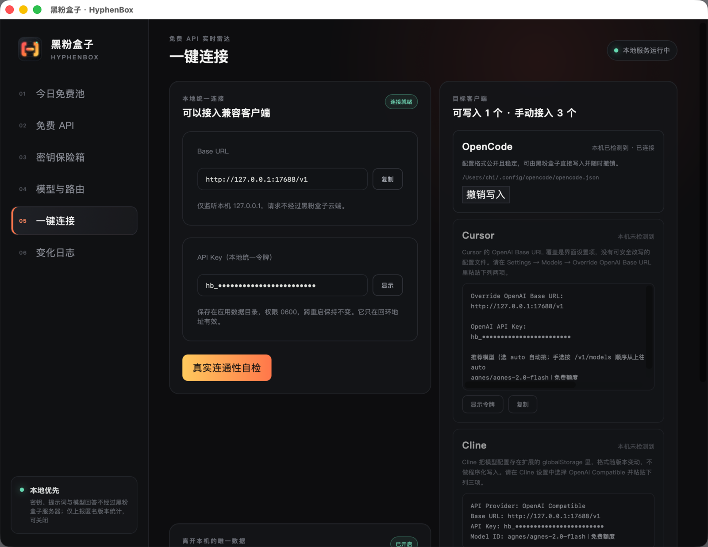

# 黑粉盒子 HyphenBox

> **免费大模型 API 雷达 + 本地统一路由。** 收录 103 家免费 API，实测哪些还活着；
> 你的 Key 只存在自己电脑里，一个本地接口接进 Cursor / Cline / OpenCode。
>
> 当前阶段：**初步构建 · 预览版**（macOS universal + Windows x64 + Linux x64）。功能在快速迭代，
> 界面与行为以最新版本为准。



## 它解决什么问题

想白嫖大模型 API 的人都干过同一件事：搜一份免费清单，挨个申请，然后发现一半
链接已经死了，剩下一半额度早改了，好不容易拿到的 Key 填进客户端还报错。
问题不在免费资源少，而在**没人替你持续验证**。

黑粉盒子做四件事：

| 环节 | 做法 |
|---|---|
| **找** | 目录收录 103 家（17 家已核验 + 86 家候选），每天在一台树莓派上自动重测端点死活，顺带标出「国内能否直连」 |
| **验** | 每个模型用你自己的 Key 真发一次对话请求，通过才进列表；打分器、下线端点、假免费一律挡在外面 |
| **标** | 每个模型带**费用五档**标识：完全免费 / 免费额度 / 扣余额 / 价格未知 / 自费——「查不到价格」不会被谎称成免费 |
| **接** | 一个本地接口（`http://127.0.0.1:17688/v1`）接进任何 OpenAI 兼容客户端；选 `auto` 由路由器按每次请求的大小和各家当下额度自动挑模型。对话之外还直通 `/v1/embeddings`（向量）、翻译旧版 `/v1/completions`（老客户端）与新方言 `/v1/responses`（Codex CLI 已实测跑通完整智能体循环，含工具调用），浏览器类工具的跨域预检也放行——鉴权仍是本地令牌 |

## 界面

**免费 API 雷达** —— 每家写明额度、申请条件、接口地址、最后复测日期；
已核验的可展开**免费模型清单**（如硅基流动官方 L0 档 16 个型号，逐个带限速与核对日期）：


**模型与路由** —— 列表顺序即推荐顺序：完全免费且可跑 agent 的排最前，
自费的垫底；每行两枚徽标（费用档 + 可用度）：



**一键连接** —— OpenCode 可直接写入配置（默认模型设为 `auto`，可随时撤销），
Cursor / Cline 给可粘贴指引；本地令牌屏幕上默认打码：



## 下载安装

- **[下载最新版](https://github.com/HackerChi-Hub/hyphenbox-release/releases/latest)**：macOS 选 `HyphenBox_x.y.z_universal.dmg`（约 10 MB，Intel/Apple 芯片通用）；Windows 选 `HyphenBox_x.y.z_x64-setup.exe`（另有 MSI）；Linux 选 AppImage（另有 deb/rpm，需桌面密钥环）
- 要求：macOS 13 及以上 / Windows 10/11 x64 / Linux x64（桌面发行版）
- 每个 Release 附 `.sha256` 校验文件；免费下载，无注册、无账号体系

### 首次打开

预览版使用自签名证书（非 Apple 开发者证书）。首次打开若被拦截：
**系统设置 → 隐私与安全性 → 仍要打开**，只需一次。

### 三步接入客户端

1. 「密钥保险箱」保存你自己申请的 Key（只写入 macOS 钥匙串）
2. 「模型与路由」拉取模型列表并一键核验
3. 「一键连接」把 Base URL 与本地令牌填进客户端——模型选 `auto` 就不用再管（应用内 `⌘1`–`⌘6` 可直接切页）

## 自动更新

应用启动时会检查
`https://github.com/HackerChi-Hub/hyphenbox-release/releases/latest/download/latest.json`，
更新包使用离线私钥签名，客户端内置公钥验签后才会应用。

## 隐私：Key 与对话不出本机

密钥只写入 macOS 钥匙串；提示词与模型回答直接从你的电脑发往你选的提供商，
不经过黑粉盒子的任何服务器。

匿名使用统计默认开启，可在应用内随时关闭；每个 UTC 日最多上报一次，
内容仅为：

```json
{ "app": "hyphenbox", "device_hash": "<64 位十六进制>",
  "version": "0.4.39", "platform": "macos", "arch": "aarch64", "day": 20696 }
```

不上报 API Key、提示词、模型回答、用量数字、文件路径、用户名或 IP，
**也不上报你用了哪些提供商或哪些模型**——那等于暴露你在哪些平台有账号。
`device_hash` 是系统机器 ID 加本应用专属命名空间后的 SHA-256，无法与其他软件的统计关联。
统计后台只展示聚合计数，需要口令查看，不公开。

## 数据更新边界

本仓库不托管免费 API 目录。桌面软件通过受控的私有数据服务定期读取经过签名的
目录更新；服务端数据源和生成流程保持私有。客户端收到的数据仍会在本机完成
签名、版本和文件哈希验证。

任何真实 API Key、账号凭据、用户提示词和模型回答都不得进入本仓库、Issue、日志或截图。

## 如实声明

- **预览版**：两个平台都没有商业代码签名证书，首次打开要手动放行一次（macOS 右键打开；Windows SmartScreen 点「更多信息 → 仍要运行」）。想自证没被掉包：对照 Release 里的 `.sha256`，或看 [Actions 构建日志](https://github.com/HackerChi-Hub/hyphenbox/actions)。Windows 版暂不含自动更新，需手动下载新版覆盖安装
- **免费额度随时会变**：软件能做的是每天替你重测一遍，不能保证你申请时额度还在
- 「免费 Key」只指你从官方渠道自行领取的凭据；共享账号、Key 池、绕额度中转一律不收录

---

黑粉科技 · [更多自制软件与文章](https://github.com/HackerChi-Hub)
