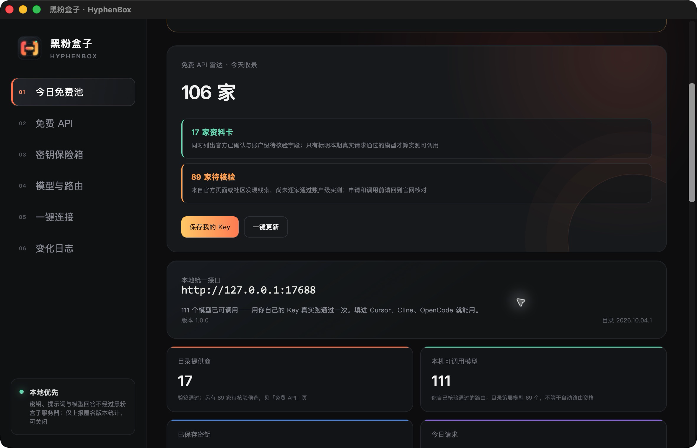
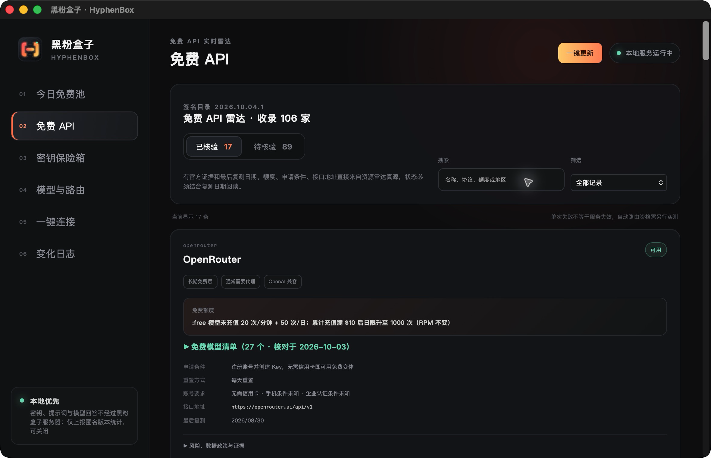
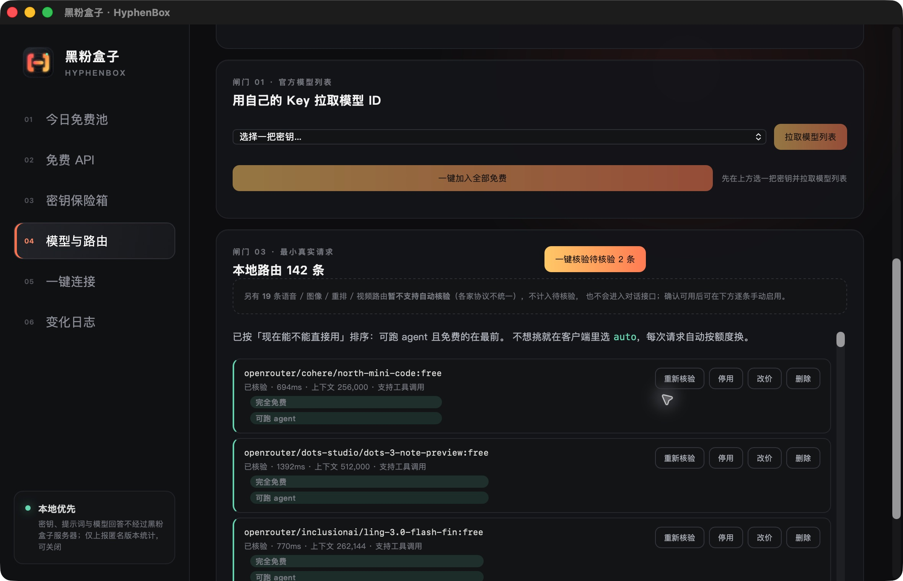
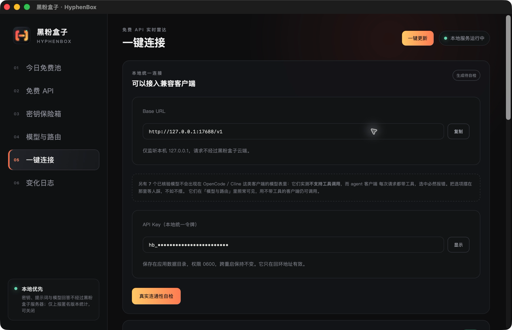

<!-- evergreen:intro:start -->

# 黑粉盒子 HyphenBox · 免費 AI API 雷達、模型核驗與統一介面

**找到合適的免費 AI 介面，用自己的金鑰測通，再接入常用 AI 程式設計工具。**

黑粉盒子是黑粉科技開發的桌面 AI API 管理工具，把免費資源發現、本機金鑰保險箱、模型核驗和本地統一路由放在一起。適合尋找免費大模型 API、管理多個提供商，或給 OpenCode、Cursor、Cline 配置相容介面的使用者。資源條件有官方證據與核對日期；模型是否能用，以你自己的賬戶和真實請求為準。

軟體免費下載，不需註冊黑粉盒子賬號。平臺金鑰需自行申請，部分平臺需要國際網路；免費額度、地區和賬戶條件以平臺為準。

<a href="README.md">简体中文</a> | <a href="README.zh-TW.md">繁體中文</a> | <a href="README.en.md">English</a>

 

<!-- evergreen:intro:end -->

<!-- recent-features:start -->
## 近期新增與改進（最近 5 項）

- **1.0.0** · 糾正近期免費資源候選的官方條件，未經賬戶級生成驗證的候選不會進入自動免費路由。
- **0.4.70** · 新增非彈窗的自願贊助板塊，累計用量達到門檻後出現，不影響功能使用。
- **0.4.70** · 累計用量數字去掉多餘的尾隨小數零，保留真實有效小數。
- **0.4.69** · 更新隨包免費 API 目錄，並恢復每日簽名目錄釋出，讓資源資訊及時重新整理。
- **0.4.69** · 本地健康介面隨目錄換版實時更新版本，避免把已更新目錄誤報為舊資料。
<!-- recent-features:end -->

<!-- evergreen:demos:start -->
## ▶ 使用示範

**金鑰儲存、OpenCode 設定寫入與 MCP 實測；YouTube 為完整介紹**

| Bilibili | YouTube |
| :---: | :---: |
|  |  |

影片示範的是拍攝時的版本；安裝套件與目前功能以本頁正式發行資訊為準。影片以中文講解。
<!-- evergreen:demos:end -->

**當前正式版：1.0.0** · [發行說明](https://github.com/HackerChi-Hub/hyphenbox-release/releases/tag/v1.0.0)

截圖拍攝於 2026 年 10 月 4 日，來自 macOS 上實際執行的 1.0.0 正式版。提供商、模型與用量數字是拍攝時這臺電腦的狀態，不是所有使用者預設可用的數量；資料卡與待核驗候選也不等於全部實測透過。

<!-- evergreen:capabilities:start -->
## 它能做什麼

免費清單解決“到哪裡找”，卻不能回答“我這把金鑰現在能不能用”。黑粉盒子把資源發現和本機呼叫分開處理：先看官方條件，再用自己的賬戶核驗，最後接入客戶端。

| 功能 | 當前能力 |
|---|---|
| 免費 API 雷達 | 搜尋和篩選資源，檢視免費型別、額度、申請門檻、介面地址、模型清單、風險、官方證據及核對日期；區分資料卡和待核驗候選 |
| 金鑰保險箱 | 儲存自己從官方渠道取得的金鑰，使用系統憑據儲存；介面預設遮罩，支援多把金鑰 |
| 模型發現與核驗 | 用自己的金鑰拉取模型列表，篩選免費模型、批次加入併傳送最小真實請求；對話和向量模型按用途驗證，不把向量模型拿去做聊天測試 |
| 費用與能力標識 | 區分完全免費、免費額度、扣餘額、價格未知和自費；展示核驗狀態、工具呼叫能力等資訊，未知價格不會自動算免費 |
| 本地統一路由 | 只監聽 `127.0.0.1`，提供相容介面、多金鑰嘗試、限流冷卻和故障切換；免費路線與一般自動路線分開 |
| 客戶端接入 | OpenCode 配置可備份後寫入、可撤銷；Cursor、Cline 和相容 SDK 提供可複製引數及接入指引 |
| 呼叫診斷與統計 | 檢視本機請求與詞元用量；最近呼叫診斷顯示輸出預算、結束原因等資訊，幫助區分輸出長度限制、限流和上游錯誤 |
| 獨立目錄更新 | 軟體定期讀取受控的簽名目錄，驗證簽名、版本和檔案雜湊；更新資源資訊不必重新下載安裝包 |

### 免費 API 雷達

免費檔、一次性試用、限時活動與開源自託管不是同一回事。先看免費型別、申請條件和核對日期，再回到平臺官方頁面確認自己賬戶的權益。資料卡里的模型清單也不能代替本機真實呼叫。

### 模型與路由

模型列表來自你自己的憑據，路由資格來自本機核驗結果。可以批次加入免費模型、核驗待驗證路線，也可以重新核驗、停用或刪除單條路線。向量模型走向量介面；語音、影象、影片與重排序等用途目前不能全部自動核驗，也不會混入聊天介面。

### 一鍵連線

統一地址是 `http://127.0.0.1:17688/v1`，客戶端使用黑粉盒子的本地統一令牌，不需要逐個平臺填寫上游金鑰。OpenCode 可以直接寫入配置並撤銷；其他客戶端按應用內指引手動填寫。面向智慧體客戶端的模型列表會篩掉已實測不支援工具呼叫的路線。

## free 與 auto 怎麼選

- `free`：只在符合已知免費條件、透過核驗且適合當前請求的路線中嘗試。免費檔可能有每日、每分鐘或賬戶額度限制，不能保證無限呼叫。
- `auto`：綜合模型能力、請求大小、費用資訊和失敗冷卻自動選路，**可能使用你已新增的付費路線**。只想用免費範圍時，請選 `free`。
- 手選模型：明確指定某條路線；該模型是否支援工具、上下文長度及輸出限制，仍受上游約束。

遇到限流、額度不足或服務錯誤，路由器會按錯誤分類冷卻並嘗試其他合格候選。全部候選不可用時會如實返回錯誤。已經向客戶端輸出內容的流式請求不會被承諾無縫換成另一個模型；軟體也不能憑空恢復平臺額度。
<!-- evergreen:capabilities:end -->

## 下載安裝

[最新版下載入口](https://github.com/HackerChi-Hub/hyphenbox-release/releases/latest)會隨正式發行更新。下面是當前 **1.0.0** 實際已上傳的安裝件；未列出的平臺不代表已有本版安裝包：

| 系統 | 安裝套件 | 要求 |
|---|---|---|
| macOS | [通用 DMG](https://github.com/HackerChi-Hub/hyphenbox-release/releases/download/v1.0.0/HyphenBox_1.0.0_universal.dmg) | macOS 13 及以上，Apple 晶片 / Intel |
| Windows | [一般安裝 EXE](https://github.com/HackerChi-Hub/hyphenbox-release/releases/download/v1.0.0/HyphenBox_1.0.0_x64-setup.exe) | Windows 10 / 11，x64 |
| Windows | [MSI](https://github.com/HackerChi-Hub/hyphenbox-release/releases/download/v1.0.0/HyphenBox_1.0.0_x64_en-US.msi) | Windows 10 / 11，x64 |
| Linux | [AppImage](https://github.com/HackerChi-Hub/hyphenbox-release/releases/download/v1.0.0/HyphenBox_1.0.0_amd64.AppImage) | x64 桌面發行版，需要系統金鑰環 / Secret Service |
| Linux | [deb](https://github.com/HackerChi-Hub/hyphenbox-release/releases/download/v1.0.0/HyphenBox_1.0.0_amd64.deb) | x64 桌面發行版，需要系統金鑰環 / Secret Service |
| Linux | [rpm](https://github.com/HackerChi-Hub/hyphenbox-release/releases/download/v1.0.0/HyphenBox-1.0.0-1.x86_64.rpm) | x64 桌面發行版，需要系統金鑰環 / Secret Service |

軟體免費下載，不需要註冊黑粉盒子賬號；呼叫平臺 API 通常仍需自行註冊平臺賬戶和申請憑據。部分平臺需要國際網路，地區、實名、支付與額度條件以平臺官方要求為準。

<!-- evergreen:installation-privacy:start -->
### 三步開始使用

1. 在「免費 API」檢視資源條件，到平臺官方入口申請自己的金鑰，再存入「金鑰保險箱」。
2. 在「模型與路由」拉取模型列表、加入候選並核驗；透過後才能作為可用路線使用。
3. 在「一鍵連線」按指引接入客戶端，先做真實連通性自檢；僅使用免費範圍時選擇 `free`。

### 首次開啟與簽名

正式推出不等於已取得商業程式碼簽名：macOS 當前使用固定本地簽名，尚未完成 Apple Developer ID 簽名和公證；Windows 安裝件尚無商業程式碼簽名，可能出現 SmartScreen 提示。macOS 被攔截時，可在確認來源後按「系統設定 → 隱私與安全性 → 仍要開啟」處理。

請只從本倉庫的發行頁下載，並核對隨發行提供的 SHA-256 校驗檔案。**更新器簽名與系統商業程式碼簽名是兩件事。**

## 介面與相容範圍

提供 `/v1/models`、`/v1/chat/completions`（含流式）、`/v1/embeddings`，以及舊版 `/v1/completions` 和 `/v1/responses` 的相容轉換。請求需要本地統一令牌，模型能力與可用範圍取決於實際路線。

相容介面不代表每家提供商都支援全部功能。工具呼叫、思考簽名、多模態、輸出上限等仍有模型和協議差異；圖片、影片、音訊及重排序生成不能一概當成已由本地聊天介面支援。長回答截斷時，可先在「一鍵連線 → 最近呼叫與結束原因」檢視輸出預算及結束原因，再核對客戶端引數和平臺限制。

## 軟體更新與資源更新

頂欄「一鍵更新」檢查簽名目錄和軟體新版本。目錄更新透過驗證後獨立應用，不要求每次都發新安裝包；應用升級讀取公開發行頁的更新清單。

安裝件與更新清單以本版發行頁為準。更新包使用離線私鑰簽名，客戶端用內建公鑰驗證後才應用。若某個平臺暫未提供更新器條目，或舊版無法自動升級，可從發行頁手動下載該平臺已有的安裝件。

## 隱私與公開邊界

- 平臺金鑰儲存在本機系統憑據儲存中。本地統一令牌儲存在應用資料目錄，用於本機迴環介面鑑權。
- 模型呼叫從本機發往所選提供商，必要的認證資訊、提示詞與回答**不經過黑粉盒子的目錄或統計伺服器**。提供商仍會收到呼叫資料，請閱讀其隱私政策。
- 匿名版本統計預設開啟，可在應用內關閉；每個 UTC 日最多上報一次，欄位包含匿名裝置雜湊、軟體版本、系統、架構與日期，不包含金鑰、對話、用量或所用提供商和模型。
- 本倉庫只公開下載、說明、截圖與更新後設資料。**原始碼、免費資源目錄、原始採集與核驗資料、私有服務配置、簽名私鑰均不在此公開。**
- 不採集或分享洩露金鑰，不提供共享賬戶或繞過額度限制的金鑰池。“免費 API”指平臺允許的免費權益，不是永久可用保證。

## 反饋問題

請在 [Issues](https://github.com/HackerChi-Hub/hyphenbox-release/issues) 附上系統、黑粉盒子版本、客戶端名稱、復現步驟及脫敏錯誤。執行日誌路徑：

- Windows：`%LOCALAPPDATA%\top.hyphentech.hyphenbox\logs\hyphenbox.log`
- macOS：`~/Library/Logs/top.hyphentech.hyphenbox/hyphenbox.log`
- Linux：`~/.local/share/top.hyphentech.hyphenbox/logs/hyphenbox.log`

日誌有認證資訊脫敏處理，但提交前仍請檢查內容。**不要把完整金鑰、令牌、賬號資訊、私人對話或私有服務地址放進 Issue、日誌附件和截圖。**
<!-- evergreen:installation-privacy:end -->

---

黑粉科技 · [更多自制軟體與文章](https://github.com/HackerChi-Hub)

<!-- evergreen:use-cases:start -->
## 適合哪些需求

| 需求 | 使用方法 |
| --- | --- |
| 找免費大模型 API | 按免費型別、額度、申請門檻和核對日期篩選官方資源 |
| 給 AI 程式設計工具配置介面 | 使用一鍵連線指引，配置本地統一地址與令牌 |
| 管理多平臺模型和金鑰 | 自己申請金鑰，在本機儲存、拉取模型並真實核驗 |
| 處理限流或輸出截斷 | 看最近呼叫診斷，再核對路線、預算、結束原因和平臺限制 |

## 常見問題

**免費 API 是永久無限使用嗎？** 不是。免費檔、試用與限時活動不同，平臺可以調整權益；目錄資訊也不等於你的賬戶已透過呼叫驗證。

**只想用免費路線該怎麼選？** 使用 `free`。`auto` 可能呼叫你已新增的付費路線，費用仍受所選提供商規則約束。

**是本地大模型執行器嗎？** 黑粉盒子主要管理提供商 API 與統一路由；需要在電腦上執行模型，可使用方寸智匣。

**會替我申請賬號和金鑰嗎？** 不會。申請、地區與身份條件按平臺官方要求完成，再用自己的憑據核驗。
<!-- evergreen:use-cases:end -->

<!-- evergreen:discovery:start -->
## 黑粉科技自制軟體

按需求選用，也可以組合使用：本地模型交給方寸智匣，雲端介面交給黑粉盒子，錄製教程用黑粉錄屏，影視英語學習用光影詞庫。

| 軟體 | 適合解決的問題 | 官方下載 |
| --- | --- | --- |
| 方寸智匣 LocalBrain | 本地大模型、檔案與媒體工作臺 | [下載方寸智匣](https://github.com/HackerChi-Hub/localbrain-releases) |
| 黑粉錄屏 HyphenScreen | 螢幕錄製、教程剪輯、字幕與動畫 | [下載黑粉錄屏](https://github.com/HackerChi-Hub/HyphenScreen-Releases) |
| 光影詞庫 ScreenLex | 看電影學英語、字幕查詞、生詞複習 | [下載光影詞庫](https://github.com/HackerChi-Hub/screenlex-download) |
| 黑粉盒子 HyphenBox | 免費 AI API 發現、模型核驗與統一介面 | [下載黑粉盒子](https://github.com/HackerChi-Hub/hyphenbox-release) |

## 分享與反饋

分享給朋友時，請複製本倉庫首頁或[官方網站](https://hyphentech.top)，讓對方按自己的系統下載當前安裝包。歡迎收藏倉庫、點亮 Star，或在本倉庫 Issues 提交使用體驗、需求和脫敏問題。

關注[嗶哩嗶哩「黑粉科技」](https://space.bilibili.com/1846717524)、[YouTube 黑粉科技頻道](https://www.youtube.com/@hyphentech_top)；公眾號和影片號搜尋「黑粉科技」，檢視實際演示與使用教程。
<!-- evergreen:discovery:end -->
